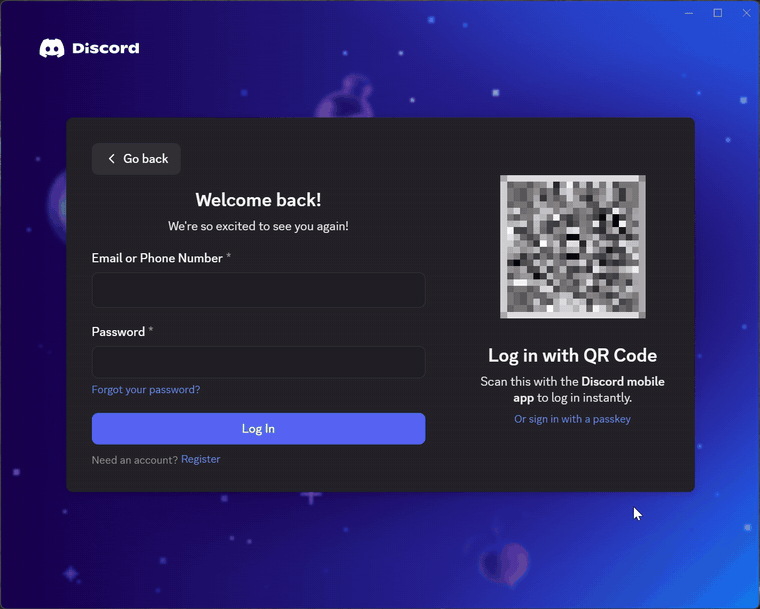
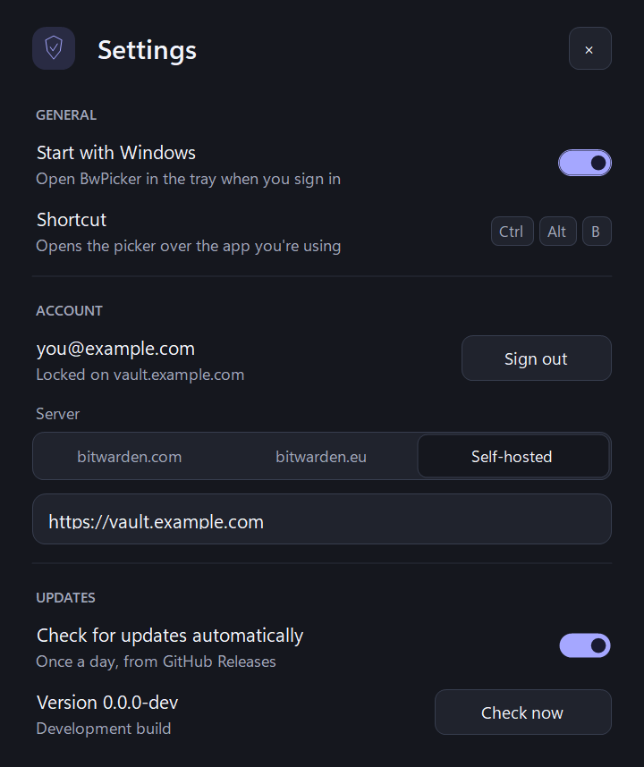

<p align="center"></p>

# BwPicker

A keyboard-driven picker that types your Bitwarden logins into **any Windows app**, not just the browser. Press a hotkey over a desktop app's login screen (a game launcher, Discord, a VPN client…), search, and press Enter.

> **Unofficial.** BwPicker is an independent project and is not affiliated with, endorsed by, or supported by Bitwarden Inc. It uses the official, signed [Bitwarden CLI](https://bitwarden.com/help/cli/) for all vault access.

<p align="center"></p>

<p align="center"><sub>Recorded with a made-up demo vault.</sub></p>

## Why

The Bitwarden browser extension only fills web pages. The desktop app's Autotype works only when a login is tagged with an `apptitle://` URI, types the first match without letting you choose, and needs a server feature flag that some self-hosted servers don't send. BwPicker gives you the browser-style list for every app instead.

## Features

- **Global hotkey** (`Ctrl+Alt+B`) opens a search popup over the app you're in.
- **Ranks logins for that app** by its process name and window title (Discord → logins named or hosted at "discord"). No URI tagging needed.
- **Two-step logins**: type the username and password together, or each on its own for sign-ins that ask for them on separate pages.
- **Copy** the username or password instead, kept out of Windows clipboard history and cleared after 30 seconds.
- **Settings window**: start with Windows, choose bitwarden.com, bitwarden.eu or your self-hosted server (including Vaultwarden), and sign in or out. No terminal needed.
- **Sign in** with email, master password and a two-step code (authenticator, email or YubiKey), or with a personal API key.
- **Updates itself** from GitHub Releases after checking the download's SHA-256 checksum. Checks daily; you can turn it off.
- **Follows Windows** light/dark mode.
- **Locks automatically** after 15 minutes idle, and immediately when Windows locks, sleeps or signs out.

| Key | Action |
|---|---|
| `Enter` | Type username, Tab, password |
| `Tab` | Type username only |
| `Ctrl+Enter` | Type password only |
| `Shift` + any of the above | Also press Enter afterwards (submit) |
| `Ctrl+U` / `Ctrl+P` | Copy username / password |
| `↑` `↓` `PgUp` `PgDn` | Move selection |
| `Esc` | Close |

## Requirements

- Windows 10 or 11
- Nothing else for the release build (it includes its own .NET runtime); the [.NET 10 SDK](https://dotnet.microsoft.com/download/dotnet/10.0) to build from source
- The official Bitwarden CLI. BwPicker refuses to run a `bw.exe` that isn't signed by Bitwarden Inc.

```powershell
winget install Bitwarden.CLI
```

## Setup

1. Start BwPicker. It sits in the system tray; double-click the icon to open **Settings**.
2. Under **Account**, choose your server (bitwarden.com, bitwarden.eu or self-hosted) and sign in.
3. Turn on **Start with Windows** if you want it running all the time.
4. Click into an app's login field and press `Ctrl+Alt+B`. After the vault auto-locks, it asks for your master password again.

<p align="center"></p>

**New-device check:** Bitwarden's cloud may email a one-time code when you sign in from a new device. The CLI only accepts that code interactively, so if sign-in reports it, either choose **Use an API key instead** (web vault → Settings → Security → Keys) or run `bw login` once in a terminal.

## Install

Download the zip from [Releases](../../releases). Releases are built by GitHub Actions from the tagged source. Each one includes a `SHA256SUMS.txt` and a signed [build provenance attestation](https://docs.github.com/actions/security-for-github-actions/using-artifact-attestations), which you can verify with:

```powershell
gh attestation verify BwPicker-win-x64.zip --repo capkz/bw-picker
```

Unzip it into a folder you can write to, such as `%LOCALAPPDATA%\Programs\BwPicker`, so it can update itself. The executable is not code-signed, so Windows SmartScreen may warn on first run. Building from source is the most trustworthy option:

```powershell
git clone https://github.com/capkz/bw-picker
cd bw-picker
dotnet build BwPicker.sln -c Release
.\src\BwPicker\bin\Release\net10.0-windows\BwPicker.exe
```

Builds from source report version `0.0.0-dev` and never update themselves.

### Apps that run as administrator

Windows doesn't let a normal app type into an app running as administrator (some game launchers do), so BwPicker tells you to use `Ctrl+U` / `Ctrl+P` and paste instead. To have it type there too, install it with the included script:

```powershell
.\Install-Admin.ps1            # from the unzipped release; asks for administrator rights once
.\Install-Admin.ps1 -Uninstall
```

It copies BwPicker to `C:\Program Files\BwPicker`, where only administrators can change it, and starts it as administrator at sign-in through a scheduled task (no UAC prompt each time). BwPicker refuses to set up admin autostart from any other folder: an admin app in a folder you can write to could be swapped by malware to gain admin rights. The trade-off is that BwPicker, the Bitwarden CLI it starts and its updater then run with administrator rights.

## Security

Read [SECURITY.md](SECURITY.md) before relying on this with important accounts. In short:

- BwPicker **stores no vault data of its own**. Signing in and syncing are done by the official CLI, which it launches with a cleaned-up environment after verifying its signature.
- **Unlocking is instant**, like the browser extension: BwPicker decrypts the CLI's end-to-end encrypted local vault in-process, using only .NET's built-in PBKDF2, HKDF, AES-256 and HMAC-SHA256, and verifies every item's MAC before decrypting it. Anything else (Argon2 accounts, organization items, a password that doesn't verify) goes through `bw unlock` instead.
- The master password and API key reach the CLI through environment variables, never on the command line. The session key and cached passwords are encrypted in memory and wiped when the vault locks.
- Typing checks, before every keystroke, that the same app is still in front with focus inside it, and that no modifier keys are held. It stops if anything changes.
- Updates come only from this repository's GitHub releases and must match the release's SHA-256 checksum.

What it **cannot** protect against:

- **It can't verify where it's typing.** It checks the window, process and title, not a web page's real origin. If you pick a login while a fake window is in front, it will type into that window. You choosing the login is the safeguard.
- Malware already running as your Windows user, keyloggers, or a compromised destination app.
- A compromised GitHub account publishing a malicious release. Turn off update checks and build from source if that matters to you.
- Antivirus heuristics: a global hotkey plus simulated typing looks like a keylogger, so some products may flag it.

The security review in SECURITY.md was AI-assisted and has not been independently audited. Reports are welcome; please open a private [security advisory](../../security/advisories/new) rather than a public issue.

## Development

```
src/BwPicker/
  App/       entry point, tray app, settings storage, autostart
  Vault/     Bitwarden CLI client, sign-in and server choice, protected memory, vault parsing
  Input/     window matching, guarded typing, clipboard
  UI/        theme, controls, picker, unlock, sign-in and settings windows
  Updates/   GitHub release check and self-update
tests/BwPicker.Tests/   regression checks with a fake CLI
```

```powershell
dotnet build BwPicker.sln -c Release
dotnet run --project tests\BwPicker.Tests                   # never touches your vault or keyboard
dotnet run --project src\BwPicker -- --preview --dark        # sample-data UI; also --light, --unlock, --settings, --signin, --query <text>
```

Exit the running tray app before rebuilding. To release, push a tag like `v1.2.3`: CI builds, tests, stamps that version into the app and publishes the release. See [tests/BwPicker.Tests/README.md](tests/BwPicker.Tests/README.md) for what the checks cover.

## License

[MIT](LICENSE)
