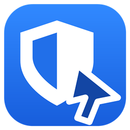
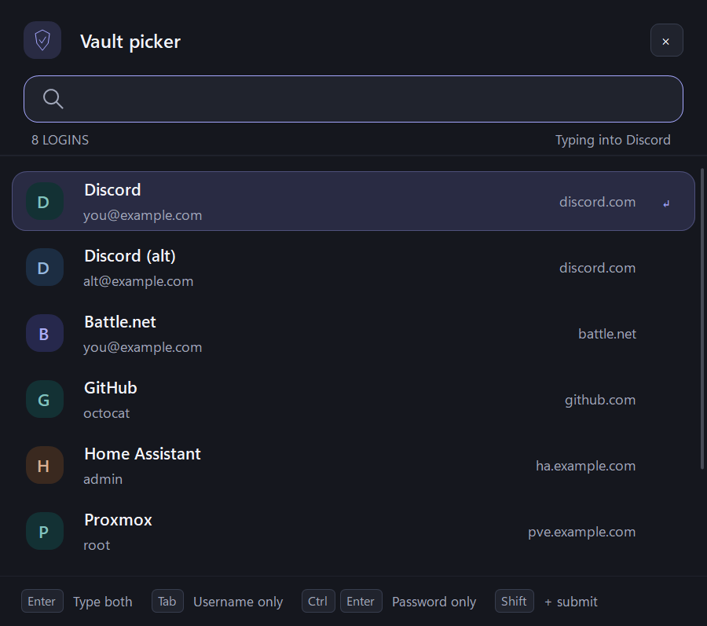

<p align="center"></p>

# BwPicker

A keyboard-driven picker that types your Bitwarden logins into **any Windows app**, not just the browser. Press a hotkey over a desktop app's login screen (a game launcher, Discord, a VPN client…), search, and press Enter.

> **Unofficial.** BwPicker is an independent project and is not affiliated with, endorsed by, or supported by Bitwarden Inc. It uses the official, signed [Bitwarden CLI](https://bitwarden.com/help/cli/) for all vault access.

<p align="center"></p>

## Why

The Bitwarden browser extension only fills web pages. The desktop app's Autotype works only when a login is tagged with an `apptitle://` URI, types the first match without letting you choose, and needs a server feature flag that some self-hosted servers don't send. BwPicker gives you the browser-style list for every app instead.

## Features

- **Global hotkey** (`Ctrl+Alt+B`) opens a search popup over the app you're in.
- **Ranks logins for that app** by its process name and window title (Discord → logins named or hosted at "discord"). No URI tagging needed.
- **Two-step logins**: type the username and password together, or each on its own for sign-ins that ask for them on separate pages.
- **Copy** the username or password instead, kept out of Windows clipboard history and cleared after 30 seconds.
- **Follows Windows** light/dark mode and accent color.
- **Locks automatically** after 15 minutes idle, and immediately when Windows locks, sleeps or signs out.
- Works with bitwarden.com, bitwarden.eu and self-hosted servers (including Vaultwarden) over HTTPS.

| Key | Action |
|---|---|
| `Enter` | Type username, Tab, password |
| `Tab` | Type username only |
| `Ctrl+Enter` | Type password only |
| `Shift` + any of the above | Also press Enter afterwards (submit) |
| `Ctrl+U` / `Ctrl+P` | Copy username / password |
| `↑` `↓` `PgUp` `PgDn` | Move selection |
| `Esc` | Close |

## Requirements

- Windows 10 or 11
- [.NET 10 Desktop Runtime](https://dotnet.microsoft.com/download/dotnet/10.0) (or the SDK to build from source)
- The official Bitwarden CLI. BwPicker refuses to run a `bw.exe` that isn't signed by Bitwarden Inc.

```powershell
winget install Bitwarden.CLI
```

## Setup

1. Point the CLI at your server (skip this for bitwarden.com):
   ```powershell
   bw config server https://vault.example.com
   ```
2. Log in once in a terminal (this is where 2FA happens):
   ```powershell
   bw login
   ```
3. Start BwPicker. It sits in the system tray; right-click it to enable **Start with Windows**.
4. Click into an app's login field and press `Ctrl+Alt+B`. The first time it asks for your master password.

## Install

Download the zip from [Releases](../../releases). Releases are built by GitHub Actions from the tagged source. Each one includes a `SHA256SUMS.txt` and a signed [build provenance attestation](https://docs.github.com/actions/security-for-github-actions/using-artifact-attestations), which you can verify with:

```powershell
gh attestation verify BwPicker-win-x64.zip --repo <owner>/bw-picker
```

The executable is not code-signed, so Windows SmartScreen may warn on first run. Building from source is the most trustworthy option:

```powershell
git clone https://github.com/<owner>/bw-picker
cd bw-picker
dotnet build -c Release
.\bin\Release\net10.0-windows\BwPicker.exe
```

## Security

Read [SECURITY.md](SECURITY.md) before relying on this with important accounts. In short:

- BwPicker does **no cryptography or vault storage of its own**. Unlocking, syncing and decryption are done by the official CLI, which it launches with a cleaned-up environment after verifying its signature.
- The master password is passed to the CLI through an environment variable, never on the command line. The session key and cached passwords are encrypted in memory and wiped when the vault locks.
- Typing checks, before every keystroke, that the same app is still in front with focus inside it, and that no modifier keys are held. It stops if anything changes.

What it **cannot** protect against:

- **It can't verify where it's typing.** It checks the window, process and title, not a web page's real origin. If you pick a login while a fake window is in front, it will type into that window. You choosing the login is the safeguard.
- Malware already running as your Windows user, keyloggers, or a compromised destination app.
- Antivirus heuristics: a global hotkey plus simulated typing looks like a keylogger, so some products may flag it.

The security review in SECURITY.md was AI-assisted and has not been independently audited. Reports are welcome; please open a private [security advisory](../../security/advisories/new) rather than a public issue.

## Development

```powershell
dotnet run --project tests\BwPicker.Tests.csproj   # regression checks; fake CLI, never touches your vault
dotnet run -- --preview --dark                      # UI with sample data; also --light, --unlock, --query <text>
```

Exit the running tray app before rebuilding. See [tests/README.md](tests/README.md) for what the checks cover.

## License

[MIT](LICENSE)
